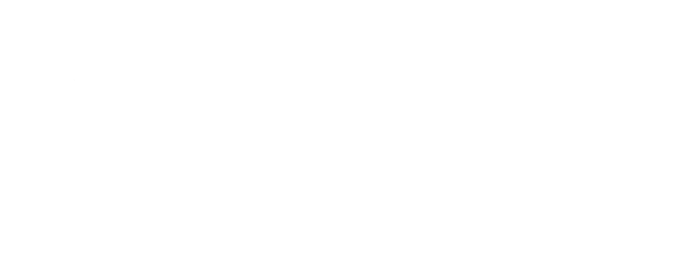
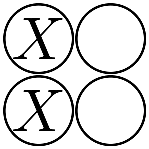
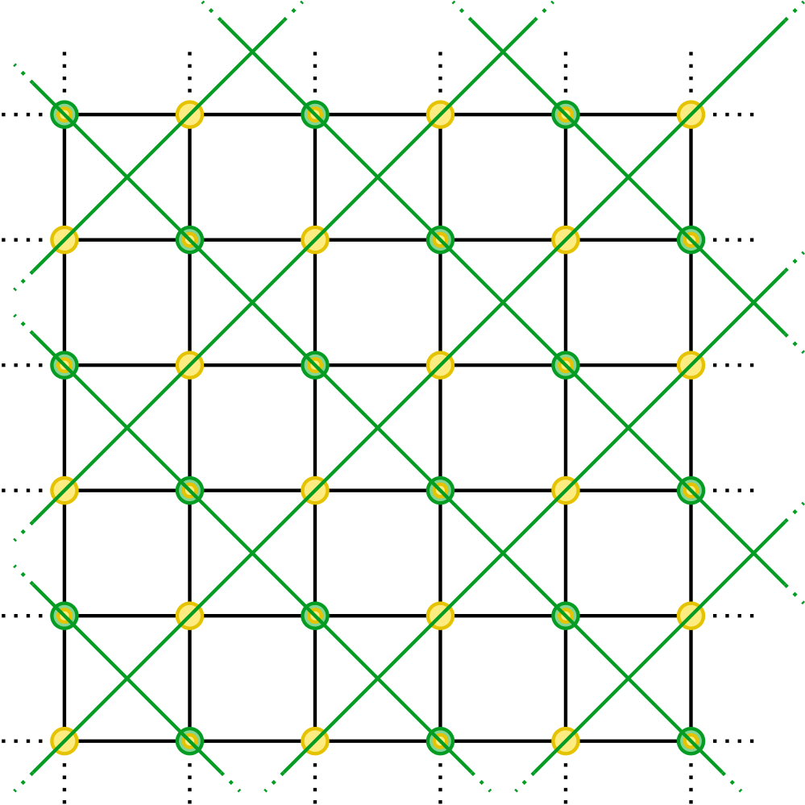

<!-- _class: "titleSlide" -->
<!-- _footer: "
EQUS — Sydney University, October 2023
" -->

 Lifting topological codes:   Single-shot codes from topological order

 Jacob Bridgeman, Aleks Kubica, and Mike Vasmer 

<a href="https://arxiv.org/abs/2305.06365" class="presentationArxiv"> arXiv:2305.06365</a>

---

<!-- _header: Overview -->
<!-- _class: twocolumn -->

1. Main idea

2. Subsystem codes

3. Single-shot QEC

4. Gauge color codes

5. Subsystem toric code

5. Subsystem abelian quantum double codes

7. Summary

---

<!-- _header: Main idea -->

- Use 2D topological codes + 3D geometry to construct 3D subsystem codes with single-shot QEC

---

<!-- _header: Subsystem codes -->
<!-- _class: twocolumn -->

$$\mathcal{H} \simeq (\mathcal{C}\otimes\mathcal{J})\oplus \mathcal{H}^\perp$$

All stabilizer codes are subsystem codes ($\mathcal{J} = \mathbb{C}$)

Pauli subsystem codes:

- $\mathcal{G} \leq \mathcal{P}^n$ : *Gauge* group (nonabelian)

- $\mathcal{S} \approx \mathcal{Z}(\mathcal{G})$ : Stabilizer group
- $\mathcal{C}\otimes\mathcal{J} = E_{+1}(\mathcal{S})$

Examples:

- Bacon-Shor code
- Gauge color code
- Subsystem toric code

Given a stabilizer code, add some logical pairs to $\mathcal{S}$ to get a subsystem code

---

<!-- _header: Subsystem codes | 4,2,2 ⟶ 4,1,2 -->

4,2,2 stabilizer code:

$\mathcal{S} = \bigg\langle$  &nbsp;,&nbsp;  $\bigg\rangle$

Two logical qubits: 

$\overline{X_1}=$  &nbsp;&nbsp;$\overline{Z_1}=$  &nbsp;&nbsp;$\overline{X_2}=$  &nbsp;&nbsp; $\overline{Z_2}=$ 

4,1,2 subsystem code: 

$\mathcal{G} = \langle \mathcal{S}, \overline{X_2}, \overline{Z_2} \rangle = \bigg\langle$  &nbsp;,&nbsp;  &nbsp;,&nbsp;  &nbsp;,&nbsp;  $\bigg\rangle$

---
<!-- _header: Subsystem codes | Why?-->

- Lower weight check operators

- More fault-tolerant logical gates

- More general formalism &ndash; Possibility for novel codes

- **Single-shot QEC**

---

<!-- _header: Single-shot QEC -->
<!-- _class: twocolumn -->

- Bombin | [arXiv:1404.5504](https://arxiv.org/abs/1404.5504)

- Single-shot QEC: correct errors in a single round of syndrome measurement

    - Even with measurement errors

---

<!-- _header: Gauge color codes -->
<!-- _class: twocolumn -->

- 3 (space) dimensional subsystem codes

- Defined on 4-colorable lattices

- Gauge operators defined on 2D faces $\mathcal{G} = \langle \otimes_{i\in\text{face} }X_{i}, \otimes_{i\in\text{face} }Z_{i}\rangle$

- Stabilizer operators associated to volumes $\mathcal{S} = \langle \otimes_{i\in\text{volume} }X_{i}, \otimes_{i\in\text{volume} }Z_{i}\rangle$

    

---

<!-- _header: Gauge color codes | Gauge flux -->
<!-- _class: twocolumn -->

- Non-abelian gauge group $\implies$ gauge measurement outcomes are random
- Gauge flux is the pattern of $-1$ outcomes
- Although outcomes are locally random, they are correlated
    - Product of gauge flux at a stabilizer must be $+1$
    - There may be other constraints

---
<!-- _header: 4,1,2 Code | Gauge flux -->

4,1,2 subsystem code: 

$\mathcal{G} = \bigg\langle$  &nbsp;,&nbsp;  &nbsp;,&nbsp;  &nbsp;,&nbsp;  $\bigg\rangle$

$\mathcal{S} = \bigg\langle$  &nbsp;,&nbsp;  $\bigg\rangle$

&nbsp;&nbsp;&nbsp;
&nbsp;&nbsp;&nbsp;

---
<!-- _header: Gauge flux | Measurement errors -->

$\mathcal{G}_{X} = \bigg\langle$  &nbsp;,&nbsp;  &nbsp;,&nbsp;  &nbsp;,&nbsp;  $\bigg\rangle$

$\mathcal{S} = \bigg\langle$  &nbsp;,&nbsp;  $\bigg\rangle$

&nbsp;&nbsp;&nbsp;

&nbsp;&nbsp;&nbsp;&nbsp;&nbsp;&nbsp;&nbsp;&nbsp;&nbsp;
&nbsp;&nbsp;&nbsp;

&nbsp;&nbsp;&nbsp;&nbsp;&nbsp;&nbsp;&nbsp;&nbsp;&nbsp;

  
&nbsp;&nbsp;&nbsp;

&nbsp;&nbsp;&nbsp;&nbsp;&nbsp;&nbsp;&nbsp;&nbsp;&nbsp;
&nbsp;&nbsp;&nbsp;

---
<!-- _header: Gauge color codes | Observations -->
<!-- _class: twocolumn -->

 

* Each volume forms a 2D *stabilizer* color code
* Qubits are *shared* between neighboring codes
* Each stabilizer can be reconstructed in 3 ways &ndash; redundancy
* Gauge fluxes can be interpreted as anyons on the 2D color codes
* Net neutral charge on sphere $\implies$ Gauss law for gauge flux

---

<!-- _header: Subsystem toric code -->

- Introduced in [arXiv:2106.02621](https://arxiv.org/abs/2106.02621)
- More elementary than gauge color code
- Separates stabilizer constraints from topological constraints (Gauss law)
- Gauge operators associated to 2D faces and vertices

---

<!-- _header: Subsystem toric code | Stabilizers -->

 

- Associated to volumes of the lattice

- Each stabilizer can be reconstructed in 2 ways &ndash; from only green or only yellow gauge operators

---

<!-- _header: Subsystem abelian quantum double code -->
<!-- _class: twocolumn -->

 

- Instead of $\mathbb{Z}_2$ (toric code), use $\mathbb{Z}_d$

- $e$ and $m$ type anyon fusion rules dictate gauge flux Gauss law

---

<!-- _header: Subsystem abelian quantum double code | Gauge flux -->
<!-- _class: twocolumn -->

1. In code space, stabilizers are $+1$, so total gauge flux (of either color) into volume must be $+1$
2) When there are physical errors, there is a net charge on a volume
    * Redundancy $\implies$ green charge = yellow charge
    * Vertices necessarily have *no* net charge, even with physical errors
3) Measurement errors can result in net charge on vertices or mismatch of charge measured at volumes

<figure>
<figcaption>Physical errors only</figcaption>
  
</figure>
<figure>
    <figcaption>Physical and measurement errors</figcaption>
  

---

<!-- _header: Error correction -->

Error correction is a two step process:
1) Validate gauge flux to remove broken loops
    - Identify end points of broken loops and match them up

2) Correct residual errors to ensure charge on volumes is neutral
    - Identify stabilizer violations and match them up

---

<!-- _header: 'Single-shot QEC | numerical evidence' -->
<!-- _class: twocolumn -->

QEC step:

1. Apply channel to each qudit

2. Compute gauge syndrome

3. Randomize each gauge outcome with probability $p$

4. Find recovery operator:
    1. Validate flux (clustering)
    2. Correct errors (clustering)

Error channel: $\mathcal{E}(\rho) := (1-p)\rho + \frac{p}{d-1} \sum_{j=1}^{d-1} Z^j \rho Z^{-1}$

---

<!-- _header: Boundaries -->
<!-- _class: twocolumn -->

- Unlike topological codes, these subsystem codes require boundaries to have logical qudits

- Our perspective lets us construct boundaries from boundaries of 2D topological models

- On $\mathbb{T}^2 \times [0,1]$, macroscopic copies of the 2D code are used to define the gauge operators

---

<!-- _header: Boundaries | Encoded qubits -->
<!-- _class: twocolumn -->

- Logical qubits associated with boundary 2D codes
- Bare logical operators are sheet-like
- Dressed logicals are boundary string operators

<iframe src="./assets/html/LogicalT2xI.html" scrolling="no" frameBorder="0">
</iframe>

---

<!-- _header: Boundaries -->

When defined on a cube, we can use the boundaries of the 2D code to define the gauge operators

<iframe src="./assets/html/roughBoundary.html" scrolling="no" frameBorder="0"  style="height:365px;width:365px;"></iframe>
<iframe src="./assets/html/RoughSmoothCorner.html" scrolling="no" frameBorder="0" style="height:365px;width:365px;"></iframe>
<iframe src="./assets/html/smoothBoundary.html" scrolling="no" frameBorder="0" style="height:365px;width:365px;"></iframe>

---

<!-- _header: Summary -->

- New perspective on topological subsystem codes
    - Single-shot property arising from interplay of *2D topological order* and *3D geometry*

- This perspective provides a **natural** generalization to any abelian group/(untwisted) abelian QD anyon model
    - Includes boundaries and logical operators
    
---

<!-- _header: Summary -->

- Beyond Pauli case?
    - Currently working on semion version. Seems to need a different geometry
    - Non-abelian case?
    - General string-net models?

- Can we fit the gauge color code into this framework?
    - The split between Gauss law and stabilizers is not as clear
    - What is the correct notion of equivalence for subsystem codes?

---

<!-- _class: questionSlide --> 
<!-- _header: "" -->
<!-- _footer: "" -->

Any questions?

[arXiv:2305.06365](https://arxiv.org/abs/2305.06365)

 Slides available at [jcbridgeman.github.io](https://jcbridgeman.github.io) 

<noscript>

</noscript>